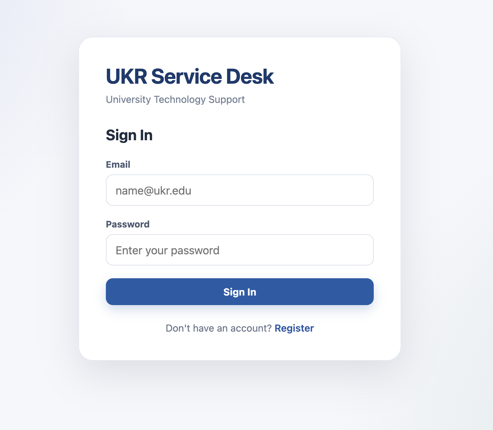
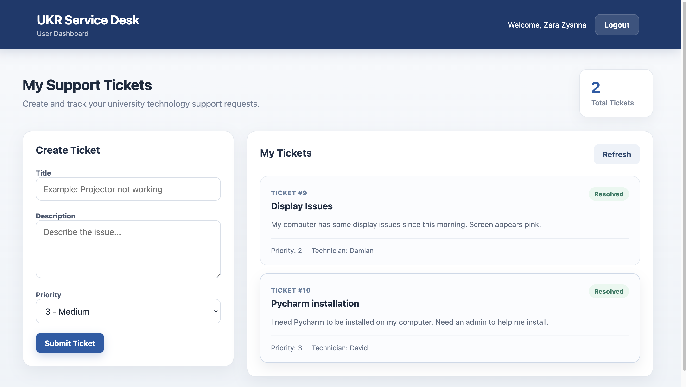
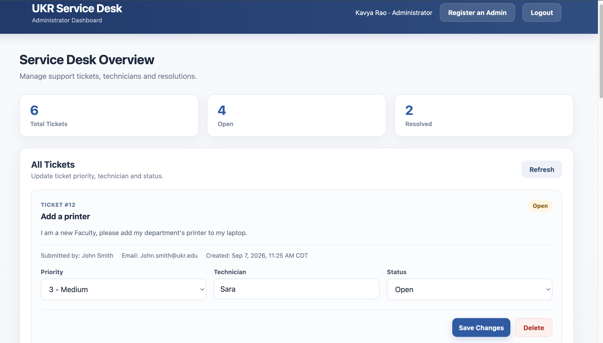

# UKR Service Desk

UKR Service Desk is a full-stack IT ticket management application built with React, ASP.NET Core, Entity Framework Core, and PostgreSQL.

I built the project to work through a complete service desk workflow: users can submit and track support requests, while administrators can manage tickets, assign technicians, update priorities, and resolve requests.

## Screenshots

### Login



### User Dashboard



### Admin Dashboard



## Features

### Users

- Register and sign in
- Submit support tickets
- Set a ticket priority
- View their own tickets
- Track ticket status
- See technician assignments

### Administrators

- View tickets from all users
- See who submitted each ticket
- Assign technicians
- Change ticket priority
- Mark tickets as resolved or reopen them
- Delete tickets
- Register additional administrators

## Tech Stack

**Frontend**
- React
- JavaScript
- React Router
- Vite
- HTML/CSS

**Backend**
- C#
- ASP.NET Core Web API
- Entity Framework Core
- ASP.NET Core Identity

**Database**
- PostgreSQL

**Authentication**
- JWT Bearer authentication
- ASP.NET Core Identity
- Role-based authorization

## Architecture

The project is split into a React frontend and an ASP.NET Core API.

```text
React
  ↓
ASP.NET Core API
  ↓
Ticket Service
  ↓
Entity Framework Core
  ↓
PostgreSQL
```

The React application calls the API for authentication and ticket operations. The API uses a service layer for ticket logic and Entity Framework Core for database access.

Authentication is handled with ASP.NET Core Identity and JWT bearer tokens. The API uses the authenticated user's ID to determine ticket ownership and role checks to protect administrator operations.

## Authorization

There are two roles in the application: `User` and `Admin`.

A normal user can only access tickets associated with their own user ID. The backend gets that ID from the authenticated user's JWT rather than accepting a user ID from the frontend.

Admin-only operations are protected on the API using role-based authorization.

For example:

```csharp
[Authorize(Roles = "Admin")]
```

This is used for operations such as deleting tickets and performing administrator ticket updates.

## Main API Endpoints

| Method | Endpoint | Description |
| --- | --- | --- |
| POST | `/api/auth/register` | Register a user |
| POST | `/api/auth/login` | Sign in |
| POST | `/api/auth/register-admin` | Register another admin |
| GET | `/api/tickets` | Get tickets available to the current user |
| GET | `/api/tickets/{id}` | Get a ticket by ID |
| POST | `/api/tickets` | Create a ticket |
| PUT | `/api/tickets/{id}` | Update a ticket |
| PUT | `/api/tickets/{id}/admin` | Admin ticket update |
| DELETE | `/api/tickets/{id}` | Delete a ticket |

## Project Structure

```text
ukr-service-desk/
├── CampusTech.Api/
│   ├── Controllers/
│   ├── Data/
│   ├── Dtos/
│   ├── Models/
│   ├── Services/
│   ├── Migrations/
│   └── Program.cs
│
├── ukr-service-desk-ui/
│   └── src/
│       ├── pages/
│       ├── api.js
│       ├── App.jsx
│       ├── main.jsx
│       └── styles.css
│
├── screenshots/
└── README.md
```

## Running Locally

### Backend

The backend requires a PostgreSQL connection string and JWT signing key.

I keep these outside the repository using .NET User Secrets.

From `CampusTech.Api`:

```bash
dotnet restore
dotnet ef database update
dotnet run
```

### Frontend

From `ukr-service-desk-ui`:

```bash
npm install
npm run dev
```

The frontend is configured to communicate with the ASP.NET Core API during local development.

## Notes

- Passwords are handled by ASP.NET Core Identity.
- Database credentials and JWT signing keys are not committed to the repository.
- EF Core migrations are included in the backend project.
- Ticket creation timestamps are stored in UTC and displayed in the UI using Central Time.

## Demo

A separate project page with screenshots and short recordings of the user and admin workflows is available here:

**[UKR Service Desk Project Demo](https://kavyaraom.github.io/ukr-service-desk-website/)**